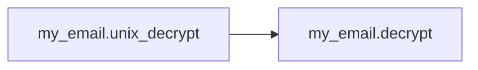
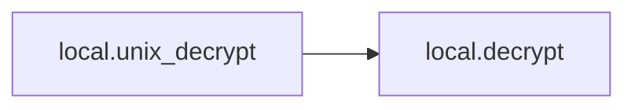
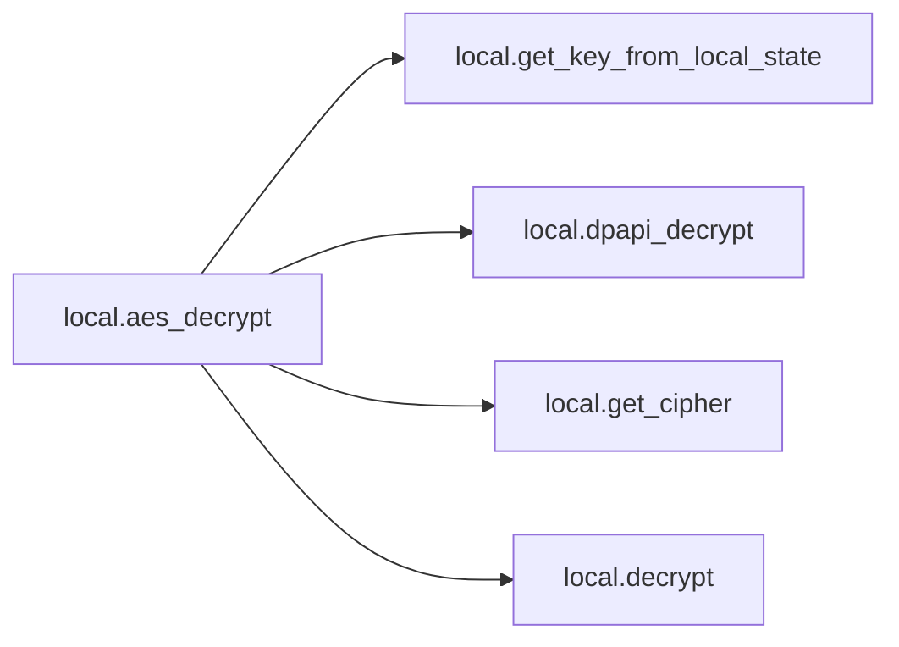
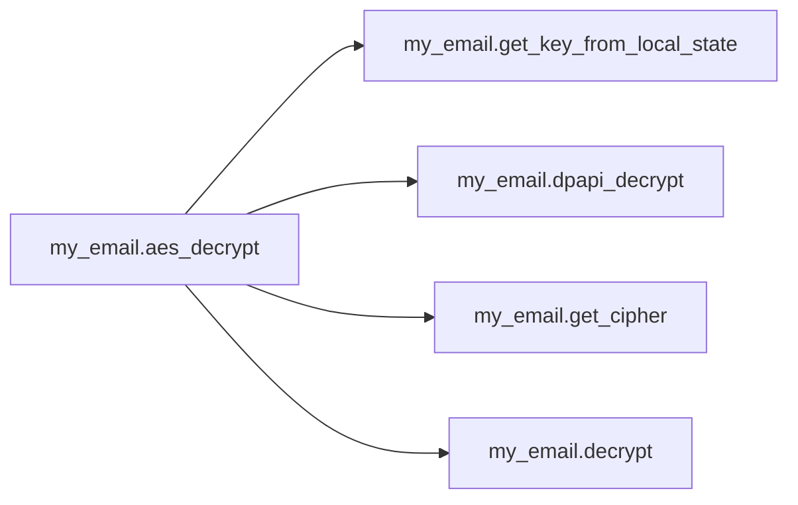

# Key Objects

[_Documentation generated by Documatic_](https://www.documatic.com)

<!---Documatic-section-local.dpapi_decrypt-start--->
## local.dpapi_decrypt

<!---Documatic-section-dpapi_decrypt-start--->
<!---Documatic-block-local.dpapi_decrypt-start--->
<details>
	<summary><code>local.dpapi_decrypt</code> code snippet</summary>

```python
def dpapi_decrypt(encrypted):
    import ctypes
    import ctypes.wintypes

    class DATA_BLOB(ctypes.Structure):
        _fields_ = [('cbData', ctypes.wintypes.DWORD), ('pbData', ctypes.POINTER(ctypes.c_char))]
    p = ctypes.create_string_buffer(encrypted, len(encrypted))
    blobin = DATA_BLOB(ctypes.sizeof(p), p)
    blobout = DATA_BLOB()
    retval = ctypes.windll.crypt32.CryptUnprotectData(ctypes.byref(blobin), None, None, None, None, 0, ctypes.byref(blobout))
    if not retval:
        raise ctypes.WinError()
    result = ctypes.string_at(blobout.pbData, blobout.cbData)
    ctypes.windll.kernel32.LocalFree(blobout.pbData)
    return result
```
</details>
<!---Documatic-block-local.dpapi_decrypt-end--->
<!---Documatic-section-dpapi_decrypt-end--->

# #
<!---Documatic-section-local.dpapi_decrypt-end--->

<!---Documatic-section-my_email.decrypt-start--->
## my_email.decrypt

<!---Documatic-section-decrypt-start--->
<!---Documatic-block-my_email.decrypt-start--->
<details>
	<summary><code>my_email.decrypt</code> code snippet</summary>

```python
def decrypt(cipher, ciphertext, nonce):
    cipher.mode = modes.GCM(nonce)
    decryptor = cipher.decryptor()
    return decryptor.update(ciphertext)
```
</details>
<!---Documatic-block-my_email.decrypt-end--->
<!---Documatic-section-decrypt-end--->

# #
<!---Documatic-section-my_email.decrypt-end--->

<!---Documatic-section-my_email.get_cipher-start--->
## my_email.get_cipher

<!---Documatic-section-get_cipher-start--->
<!---Documatic-block-my_email.get_cipher-start--->
<details>
	<summary><code>my_email.get_cipher</code> code snippet</summary>

```python
def get_cipher(key):
    cipher = Cipher(algorithms.AES(key), None, backend=default_backend())
    return cipher
```
</details>
<!---Documatic-block-my_email.get_cipher-end--->
<!---Documatic-section-get_cipher-end--->

# #
<!---Documatic-section-my_email.get_cipher-end--->

<!---Documatic-section-local.encrypt-start--->
## local.encrypt

<!---Documatic-section-encrypt-start--->
<!---Documatic-block-local.encrypt-start--->
<details>
	<summary><code>local.encrypt</code> code snippet</summary>

```python
def encrypt(cipher, plaintext, nonce):
    cipher.mode = modes.GCM(nonce)
    encryptor = cipher.encryptor()
    ciphertext = encryptor.update(plaintext)
    return (cipher, ciphertext, nonce)
```
</details>
<!---Documatic-block-local.encrypt-end--->
<!---Documatic-section-encrypt-end--->

# #
<!---Documatic-section-local.encrypt-end--->

<!---Documatic-section-my_email.get_key_from_local_state-start--->
## my_email.get_key_from_local_state

<!---Documatic-section-get_key_from_local_state-start--->
<!---Documatic-block-my_email.get_key_from_local_state-start--->
<details>
	<summary><code>my_email.get_key_from_local_state</code> code snippet</summary>

```python
def get_key_from_local_state():
    jsn = None
    with open(os.path.join(os.environ['LOCALAPPDATA'], 'Google\\Chrome\\User Data\\Local State'), encoding='utf-8', mode='r') as f:
        jsn = json.loads(str(f.readline()))
    return jsn['os_crypt']['encrypted_key']
```
</details>
<!---Documatic-block-my_email.get_key_from_local_state-end--->
<!---Documatic-section-get_key_from_local_state-end--->

# #
<!---Documatic-section-my_email.get_key_from_local_state-end--->

<!---Documatic-section-my_email.unix_decrypt-start--->
## my_email.unix_decrypt

<!---Documatic-section-unix_decrypt-start--->


### Object Calls

* my_email.decrypt

<!---Documatic-block-my_email.unix_decrypt-start--->
<details>
	<summary><code>my_email.unix_decrypt</code> code snippet</summary>

```python
def unix_decrypt(encrypted):
    if sys.platform.startswith('linux'):
        password = 'peanuts'
        iterations = 1
    else:
        raise NotImplementedError
    from Crypto.Cipher import AES
    from Crypto.Protocol.KDF import PBKDF2
    salt = 'saltysalt'
    iv = ' ' * 16
    length = 16
    key = PBKDF2(password, salt, length, iterations)
    cipher = AES.new(key, AES.MODE_CBC, IV=iv)
    decrypted = cipher.decrypt(encrypted[3:])
    return decrypted[:-ord(decrypted[-1])]
```
</details>
<!---Documatic-block-my_email.unix_decrypt-end--->
<!---Documatic-section-unix_decrypt-end--->

# #
<!---Documatic-section-my_email.unix_decrypt-end--->

<!---Documatic-section-my_email.dpapi_decrypt-start--->
## my_email.dpapi_decrypt

<!---Documatic-section-dpapi_decrypt-start--->
<!---Documatic-block-my_email.dpapi_decrypt-start--->
<details>
	<summary><code>my_email.dpapi_decrypt</code> code snippet</summary>

```python
def dpapi_decrypt(encrypted):
    import ctypes
    import ctypes.wintypes

    class DATA_BLOB(ctypes.Structure):
        _fields_ = [('cbData', ctypes.wintypes.DWORD), ('pbData', ctypes.POINTER(ctypes.c_char))]
    p = ctypes.create_string_buffer(encrypted, len(encrypted))
    blobin = DATA_BLOB(ctypes.sizeof(p), p)
    blobout = DATA_BLOB()
    retval = ctypes.windll.crypt32.CryptUnprotectData(ctypes.byref(blobin), None, None, None, None, 0, ctypes.byref(blobout))
    if not retval:
        raise ctypes.WinError()
    result = ctypes.string_at(blobout.pbData, blobout.cbData)
    ctypes.windll.kernel32.LocalFree(blobout.pbData)
    return result
```
</details>
<!---Documatic-block-my_email.dpapi_decrypt-end--->
<!---Documatic-section-dpapi_decrypt-end--->

# #
<!---Documatic-section-my_email.dpapi_decrypt-end--->

<!---Documatic-section-local.decrypt-start--->
## local.decrypt

<!---Documatic-section-decrypt-start--->
<!---Documatic-block-local.decrypt-start--->
<details>
	<summary><code>local.decrypt</code> code snippet</summary>

```python
def decrypt(cipher, ciphertext, nonce):
    cipher.mode = modes.GCM(nonce)
    decryptor = cipher.decryptor()
    return decryptor.update(ciphertext)
```
</details>
<!---Documatic-block-local.decrypt-end--->
<!---Documatic-section-decrypt-end--->

# #
<!---Documatic-section-local.decrypt-end--->

<!---Documatic-section-my_email.encrypt-start--->
## my_email.encrypt

<!---Documatic-section-encrypt-start--->
<!---Documatic-block-my_email.encrypt-start--->
<details>
	<summary><code>my_email.encrypt</code> code snippet</summary>

```python
def encrypt(cipher, plaintext, nonce):
    cipher.mode = modes.GCM(nonce)
    encryptor = cipher.encryptor()
    ciphertext = encryptor.update(plaintext)
    return (cipher, ciphertext, nonce)
```
</details>
<!---Documatic-block-my_email.encrypt-end--->
<!---Documatic-section-encrypt-end--->

# #
<!---Documatic-section-my_email.encrypt-end--->

<!---Documatic-section-local.unix_decrypt-start--->
## local.unix_decrypt

<!---Documatic-section-unix_decrypt-start--->


### Object Calls

* local.decrypt

<!---Documatic-block-local.unix_decrypt-start--->
<details>
	<summary><code>local.unix_decrypt</code> code snippet</summary>

```python
def unix_decrypt(encrypted):
    if sys.platform.startswith('linux'):
        password = 'peanuts'
        iterations = 1
    else:
        raise NotImplementedError
    from Crypto.Cipher import AES
    from Crypto.Protocol.KDF import PBKDF2
    salt = 'saltysalt'
    iv = ' ' * 16
    length = 16
    key = PBKDF2(password, salt, length, iterations)
    cipher = AES.new(key, AES.MODE_CBC, IV=iv)
    decrypted = cipher.decrypt(encrypted[3:])
    return decrypted[:-ord(decrypted[-1])]
```
</details>
<!---Documatic-block-local.unix_decrypt-end--->
<!---Documatic-section-unix_decrypt-end--->

# #
<!---Documatic-section-local.unix_decrypt-end--->

<!---Documatic-section-local.get_key_from_local_state-start--->
## local.get_key_from_local_state

<!---Documatic-section-get_key_from_local_state-start--->
<!---Documatic-block-local.get_key_from_local_state-start--->
<details>
	<summary><code>local.get_key_from_local_state</code> code snippet</summary>

```python
def get_key_from_local_state():
    jsn = None
    with open(os.path.join(os.environ['LOCALAPPDATA'], 'Google\\Chrome\\User Data\\Local State'), encoding='utf-8', mode='r') as f:
        jsn = json.loads(str(f.readline()))
    return jsn['os_crypt']['encrypted_key']
```
</details>
<!---Documatic-block-local.get_key_from_local_state-end--->
<!---Documatic-section-get_key_from_local_state-end--->

# #
<!---Documatic-section-local.get_key_from_local_state-end--->

<!---Documatic-section-local.aes_decrypt-start--->
## local.aes_decrypt

<!---Documatic-section-aes_decrypt-start--->


### Object Calls

* local.get_key_from_local_state
* local.dpapi_decrypt
* local.get_cipher
* local.decrypt

<!---Documatic-block-local.aes_decrypt-start--->
<details>
	<summary><code>local.aes_decrypt</code> code snippet</summary>

```python
def aes_decrypt(encrypted_txt):
    encoded_key = get_key_from_local_state()
    encrypted_key = base64.b64decode(encoded_key.encode())
    encrypted_key = encrypted_key[5:]
    key = dpapi_decrypt(encrypted_key)
    nonce = encrypted_txt[3:15]
    cipher = get_cipher(key)
    return decrypt(cipher, encrypted_txt[15:], nonce)
```
</details>
<!---Documatic-block-local.aes_decrypt-end--->
<!---Documatic-section-aes_decrypt-end--->

# #
<!---Documatic-section-local.aes_decrypt-end--->

<!---Documatic-section-my_email.aes_decrypt-start--->
## my_email.aes_decrypt

<!---Documatic-section-aes_decrypt-start--->


### Object Calls

* my_email.get_key_from_local_state
* my_email.dpapi_decrypt
* my_email.get_cipher
* my_email.decrypt

<!---Documatic-block-my_email.aes_decrypt-start--->
<details>
	<summary><code>my_email.aes_decrypt</code> code snippet</summary>

```python
def aes_decrypt(encrypted_txt):
    encoded_key = get_key_from_local_state()
    encrypted_key = base64.b64decode(encoded_key.encode())
    encrypted_key = encrypted_key[5:]
    key = dpapi_decrypt(encrypted_key)
    nonce = encrypted_txt[3:15]
    cipher = get_cipher(key)
    return decrypt(cipher, encrypted_txt[15:], nonce)
```
</details>
<!---Documatic-block-my_email.aes_decrypt-end--->
<!---Documatic-section-aes_decrypt-end--->

# #
<!---Documatic-section-my_email.aes_decrypt-end--->

<!---Documatic-section-local.get_cipher-start--->
## local.get_cipher

<!---Documatic-section-get_cipher-start--->
<!---Documatic-block-local.get_cipher-start--->
<details>
	<summary><code>local.get_cipher</code> code snippet</summary>

```python
def get_cipher(key):
    cipher = Cipher(algorithms.AES(key), None, backend=default_backend())
    return cipher
```
</details>
<!---Documatic-block-local.get_cipher-end--->
<!---Documatic-section-get_cipher-end--->

# #
<!---Documatic-section-local.get_cipher-end--->

[_Documentation generated by Documatic_](https://www.documatic.com)